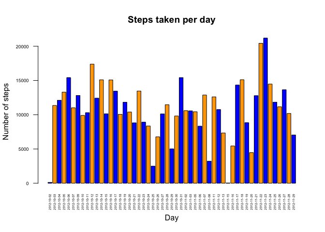
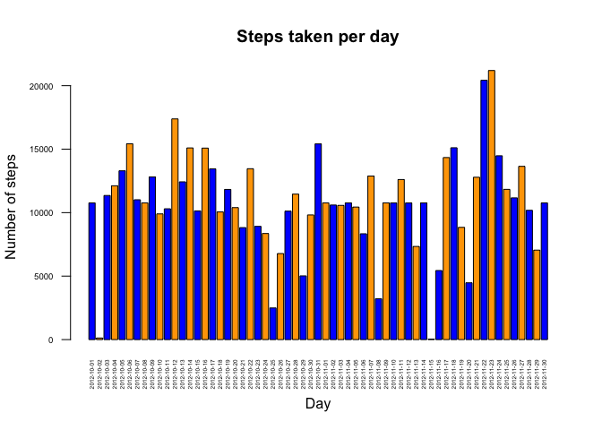
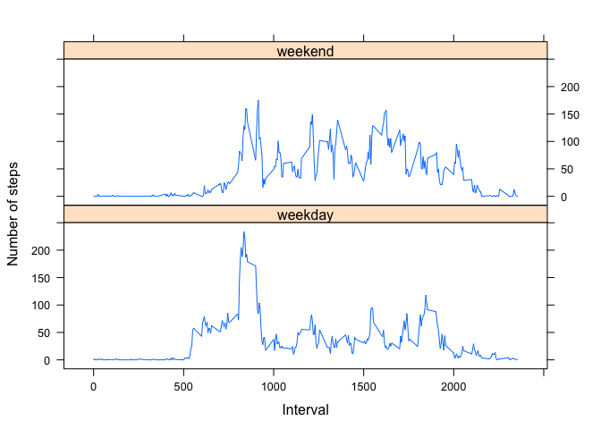

# Reproducible Research: Peer Assessment 1

## Loading and preprocessing the data


```r
Data <- read.csv(file="activity.csv", header=TRUE, sep=",")
```


## What is mean total number of steps taken per day?

```r
d <- na.omit(Data)
D <- aggregate(d$steps, by=list(d$date), FUN=sum)
names(D) <- c("Day" , "Steps")

barplot(D$Steps , main="Steps taken per day", col=c("blue","orange"),
  xlab="Day", ylab="Number of steps", cex.axis=0.6, cex.names=0.4,
  names.arg = D$Day, las= 2, beside = TRUE)
```

 

```r
mean(D$Steps)
```

```
## [1] 10766
```

```r
median(D$Steps)
```

```
## [1] 10765
```


## What is the average daily activity pattern?

```r
D2 <- aggregate(d$steps, by=list(d$interval), FUN=mean)
names(D2) <- c("Interval","Steps")
with(D2, plot( D2$Interval, D2$Steps, type="l",
                xlab="5-minute interval", 
                ylab=expression("average number of steps taken"), 
                main=expression(atop("Average daily activity pattern") ) ) )
```

 

```r
subset(D2$Interval, D2$Steps==max(D2$Steps))
```

```
## [1] 835
```

```r
D2[D2$Steps==max(D2$Steps),]
```

```
##     Interval Steps
## 104      835 206.2
```


## Imputing missing values

```r
sum(is.na(Data))
```

```
## [1] 2304
```

```r
D3 <- data.frame(ifelse(is.na(Data$steps), D2$Steps[match(D2$Interval, Data$interval)], Data$steps), Data$date,Data$interval)
names(D3) <- c("Steps","Day","Interval")
D3s <- aggregate(D3$Steps, by=list(D3$Day), FUN=sum)
names(D3s) <- c("Day","Steps")

barplot(D3s$Steps , main="Steps taken per day", col=c("blue","orange"),
  xlab="Day", ylab="Number of steps", cex.axis=0.6, cex.names=0.4,
  names.arg = D3s$Day, las= 2, beside = TRUE)
```

 

```r
mean(D3s$Steps)
```

```
## [1] 10766
```

```r
median(D3s$Steps)
```

```
## [1] 10766
```


## Are there differences in activity patterns between weekdays and weekends?

```r
D4 <- data.frame(Data,ifelse(as.POSIXlt(D3$Day,format="%Y-%m-%d")$wday %in% c(6,0), "weekend", "weekday" ))
names(D4) <- c("steps","date","interval","daytype")
d4 <- na.omit(D4)
D4p <- aggregate(d4$steps, by=list(d4$interval,d4$daytype), FUN=mean)
names(D4p) <- c("interval","daytype","mean")
library(lattice)
xyplot(D4p$mean ~ D4p$interval | D4p$daytype, type = "l", 
xlab = "Interval", ylab = "Number of steps", layout = c(1, 2) )
```

 
